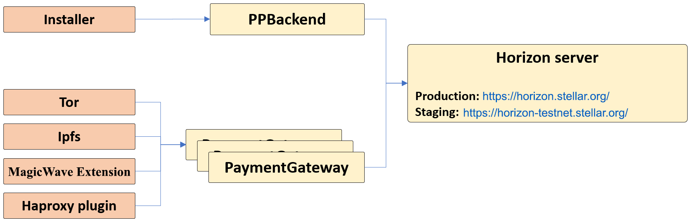

# MagicWave Stellar integration

MagicWave's native tokens - `MagicWaveTokens` (`MWT`) - are implemented as Stellar `assets`. All (micro)payments in the MagicWave ecosystem utilize `MWT`. `MWT` can be exchanged to/from Stellar's native token - XLM (Lumen) - via the decentralized exchange (DEX) mechanisms built into Stellar.
Stellar native currency is XLM (Lumens) and XLM balance is required for every live account.
Besides transaction fees, positive balance is required for keeping the account above minimum permissible balance, which is 2 XLM (1 XLM for account minimum + 1 XLM for `MWT` trust line).

All MagicWave software modules require connectivity to Stellar network, usually done through PaymentGateway module. PaymentGateway, in turn, connects directly to Stellar using one of the available Horizon servers.
Since standard Horizon API is used, public horizon server can be used (https://horizon.stellar.org/) , or MagicWave dedicated server, as listed in the diagram below.

Accounts are at the heart of the Stellar network. Accounts hold a balance in XLM, `magicwave_token` or any other valid Stellar asset. An account consists of a Account ID (public key) and a *secret* (private) key. The Account ID is public: anyone can pay to the account, while the secret key is ... secret. Knowing the secret key is required for paying _by_ this account. For example, `SB66SLUNMNW4CP3JDZV2OUGPEELDNWQTVN6ZM2RRWKTZ3F2VG64JK5SR` is a secret key and `GDEAZKI6RFHTVJ5SG7HUZYIQKBUIEVRJOG75XODHXJUEYKTNEHO5P3A2` is its (public) account ID. Needless to say (but we'll say it anyway) **keep your secret keys secret**.

To use a stellar account with MagicWave it needs to be able to make and accept payments in MagicWave currency - `MWT` assets.
A stellar asset is defined using two parameters, asset code and issuer.
For `MagicWaveToken` asset the code is `MWT` and the issuer address is "GC4EEF32WLRFI7ZU7SKZ4Q7PMITKYAAMZK65AKD2PLI6E5WKYCN7OZCE".
Once you set up `MWT` currency for your account (Called setting up a trust line), you can receive and make payments in `MWT` currency.